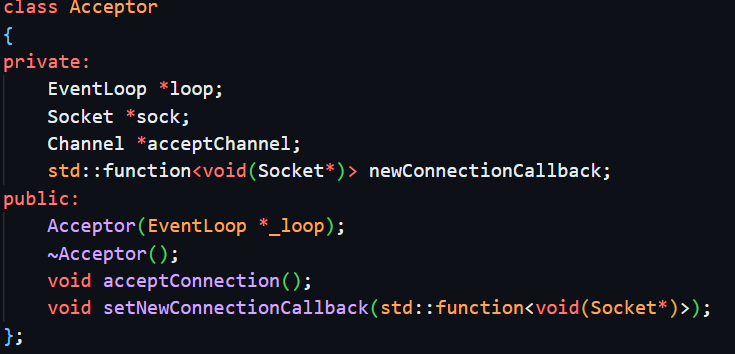
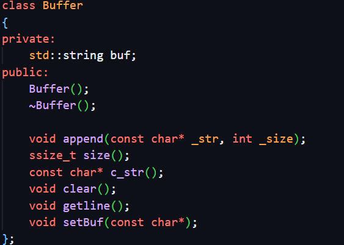
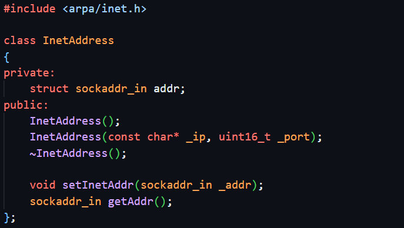
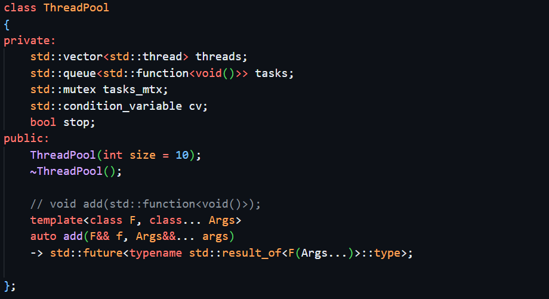
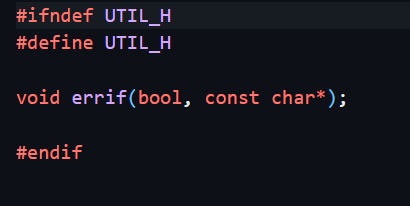
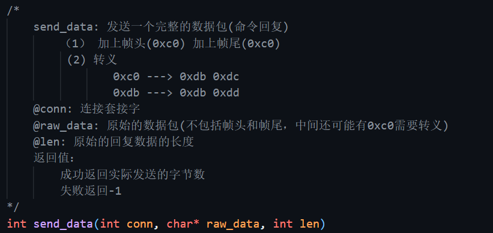
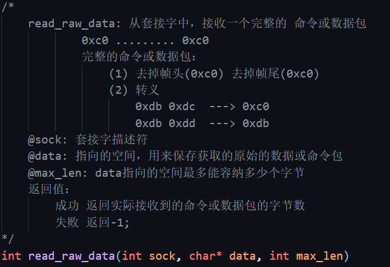
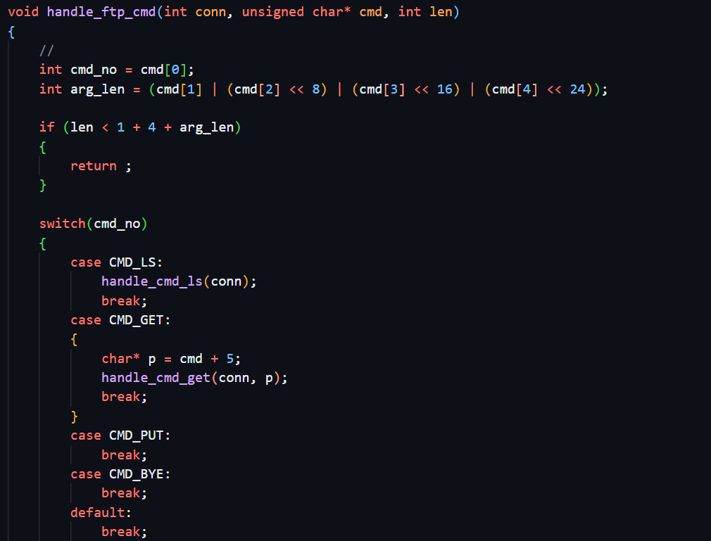
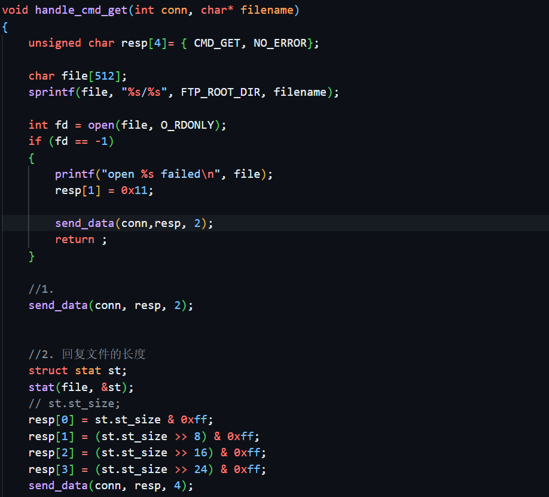

### FTP项目

基于C++面向对象的思想

**我们可以封装成如下的类**

#### Acceptor



这是一个事件接受类

设置 监听者对象和新连接的事件的回调函数和epoll下的监听。

#### Buffer



这是一个数据缓冲类

他可以把接收到的数据 进行封包 

他也可以把发送的数据进行封包

**防止他断断续续的发送和接受** 

比如我们不知道客户端信息的真正大小是多少，只能以1024的读缓冲区去读TCP缓冲区（就算TCP缓冲区的数据没有1024，也会把后面的用空值补满）；也不能一次性读取所有客户端数据，再统一发给客户端。

> 关于TCP缓冲区、socket IO读取的细节，在《UNIX网络编程》卷一中有详细说明，想要精通网络编程几乎是必看的

虽然以上提到的缺点以C语言编程的方式都可以解决，但我们仍然希望以一种更加优美的方式读写socket上的数据，和其他模块一样，脱离底层，让我们使用的时候不用在意太多底层细节。所以封装一个缓冲区是很有必要的，为每一个`Connection`类分配一个读缓冲区和写缓冲区，从客户端读取来的数据都存放在读缓冲区里，这样`Connection`类就不再直接使用`char buf[]`这种最笨的缓冲区来处理读写操作。


#### Epoll


对epoll这棵红黑树进行封装


#### EventLoop


事件  循环驱动  React


#### InetAddress




IP与端口的封装类


#### Server


封装成Server类


#### Socket


对套接字进行封装


#### ThreadPool



线程池封装


#### error



对错误封装


### ftp处理 发送与接受


通过宏确定我们的发送与上传对目录


ftp 命令的映射




对需要发送的数据进行 加密发送 

因为在 包的封装里面 0xc0 --------- 0x0c  如果不进行 可能会把包的数据发送错误

0xdb     .................

所以我们需要把 发送的数据包进行转换





 数据包的接受  把发送过来的数据包进行解析





包命令的判断 



因为 网路 传输是大端模式 进行转换


将数据长度转换为四个字节的形式，是因为在网络传输过程中，数据是以字节流的形式传输的，而不是以整数或其他数据类型的形式传输的。因此，在发送方和接收方之间传输数据时，需要将数据转换为字节流的形式，并按照一定的协议进行封装和解析，以确保数据能够正确地传输和解析。

在TCP协议中，数据分段并带有头部信息，其中包括数据的长度。将数据长度转换为四个字节的形式，可以确保在接收方接收数据时，能够正确地解析数据的长度，并从字节流中读取正确的数据内容。


```
在发送文件时，通常会使用文件传输协议（如FTP或TFTP）进行传输，而不是直接使用TCP协议。这些文件传输协议已经定义了文件传输的格式和协议，因此在发送和接收文件时，无需手动进行数据转换。

此外，文件传输协议通常会使用二进制传输模式，这意味着在传输文件时，文件的内容会以字节流的形式传输，而不需要将其转换为其他形式。因此，在使用文件传输协议进行文件传输时，发送方和接收方无需手动进行数据转换，文件传输协议会自动处理数据的格式和协议，以确保数据能够正确地传输和解析。
```


